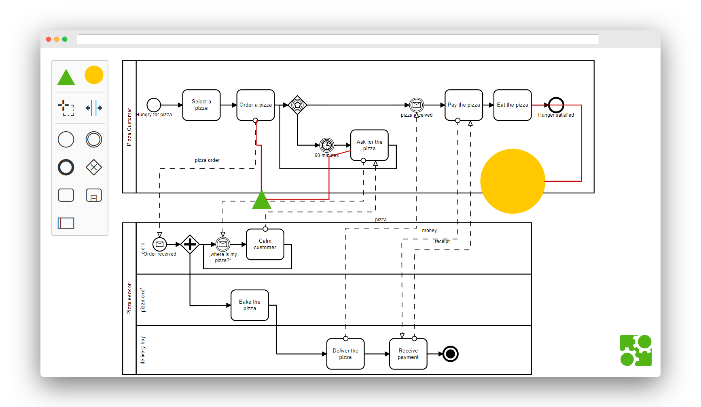

> :warning: Should custom elements be serialized within the BPMN 2.0 diagram? If that is the case, this example is not what you are looking for. Checkout our [:notebook: custom elements guide](https://github.com/bpmn-io/bpmn-js-examples/tree/master/custom-elements) to learn how to build custom elements in a BPMN 2.0 compatible way.


# bpmn-js example: Custom Shapes

This advanced example shows how to extend [bpmn-js](https://github.com/bpmn-io/bpmn-js) with new shapes and connections that are __not part of the BPMN 2.0 diagram / incompatible with the BPMN 2.0 standard__. Consult our [:notebook: custom elements guide](https://github.com/bpmn-io/bpmn-js-examples/tree/master/custom-elements) to learn how to extend the toolkit in a BPMN 2.0 compliant way.

## About

This example extends [bpmn-js](https://github.com/bpmn-io/bpmn-js), creating a custom BPMN modeler that can display and add custom shapes and connections to BPMN 2.0 diagrams.

The renderer ships with custom rules that define which modeling operations are possible on custom shapes and connections.
It can import custom shapes and connections from a [JSON](http://json.org/) descriptor and updates their properties during modeling.




## Usage Summary

The example provides a [custom modeler](app/custom-modeler/index.js). After instantiation, the modeler allows you to add and get custom shapes and connections.

```javascript
// add custom elements
var customElements = [
  {
    type: "custom:triangle",
    id: "CustomTriangle_1",
    x: 300,
    y: 300
  },
  {
    type: "custom:connection",
    id: "CustomConnection_1",
    source: "CustomTriangle_1",
    target: "Task_1",
    waypoints: [
      // ...
    ]
 }
];

customModeler.addCustomElements(customElements);


// get them after modeling
customModeler.getCustomElements(); // all currently existing custom elements
```

The modeler ships with a [module](app/custom-modeler/custom/index.js) that provides the following [bpmn-js](https://github.com/bpmn-io/bpmn-js) extensions:

* [`CustomContextPadProvider`](app/custom-modeler/custom/CustomContextPadProvider.js): A custom context pad that allows you to connect custom elements to BPMN elements
* [`CustomElementFactory`](app/custom-modeler/custom/CustomElementFactory.js): A factory that knows about how to create BPMN and custom shapes
* [`CustomOrderingProvider`](app/custom-modeler/custom/CustomOrderingProvider.js): A provider that ensures custom connections are always rendered on top
* [`CustomPalette`](app/custom-modeler/custom/CustomPalette.js): A custom palette that allows you to create custom elements
* [`CustomRenderer`](app/custom-modeler/custom/CustomRenderer.js): A renderer that knows how to draw custom elements
* [`CustomRules`](app/custom-modeler/custom/CustomRules.js): A rule provider that defines the allowed interaction with custom elements
* [`CustomUpdater`](app/custom-modeler/custom/CustomUpdater.js): An updater that updates business data while the user interacts with the diagram


## Run this Example

Fetch dependencies:

```
npm install
```

Build example and open in your browser:

```
npm run dev
```

Run tests:

```
npm test
```

## License

MIT
